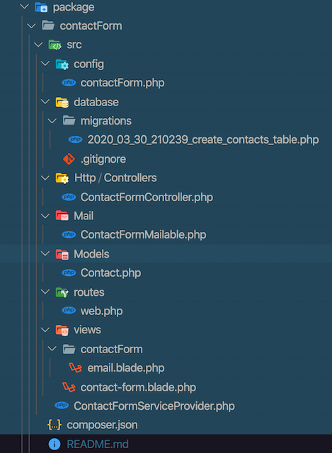

# How to Create a Laravel Package 

### *By Norcius Noel*

Before we can start creating the Laravel package, I think it would useful to first describe what is a package and how it gets used in a Laravel project.

A package is a  stand-alone source code that developers create that can be integrated into a project that provides additional functionalities which Laravel does not provide out of the box. Developers only need to import by "require" the package through Composer and adapt it to their projects.

## Create Laravel Packages

 I created a Laravel package just to make it easy to understand the process. The package is a contact form that sends an email alert to the Administrator each time the form get used. The form submission request also get saved to the database. This guide will provide a step by step instruction on how to create such a package.  
 As I just mentioned previously, you are going to need Composer, an account with (<https://packagist.org)> where you publish the package, a GitHub account which most of you already have, and fresh install of Laravel project to host the package. Let's get started.

### Create a new Laravel project

Refer to the Laravel documentation if you need further assistance. <https://Laravel.com/docs/7.x/packages/>

+ Create a new Laravel project with package "name-it-what-ever-you-want" by running this code below.

```PHP
    "composer create-project Laravel/Laravel form-package"
```

In the root directory of the newly created project which I will call the "host" from now on, create a  folder and name it "src".  Inside the "src" folder, you are going to create composer.json and service provider files. Depending on the sophistication of your package, you are going to need at least these two files on your package. In some instances, you may also create a `dist` branch if you are compiling your assets for a production server. In this way, developers that will be using your package will have an option to choose between the source files in the src folder or the distribution files in the `dist` folder when installing your package through Composer.

+ To Create the composer.json file, navigate inside the "src" run this command and follow the prompt: 

```PHP
    "composer init"
```

+ Note that the composer.json in your host project is different from the composer.json in your package. Be sure you are editing the correct composer.json file. Your composer.json file should look similar to this code below:

```PHP
    {
        "name": "nnoel/contact-form",
        "description": "This contact will alert Admin for every form  submission and save inquiries to database",
         "type": "library",
         "license": "MIT",
         "authors": [
            {
             "name": "Norcius Noel",
             "email": "nnoel@fas.harvard.edu"
            }
            ],
            "minimum-stability": "dev",
            "require": {},
            }
    }
```

+ Now let's create the ServiceProvider class for the contact form. At the command prompt run:

```PHP
    "php artisan make:provider ContactFormServiceProvider.php"
```

+ The service provider class that you just created is inside the provider folder of the "host" project.  You need to copy the file from the service provider folder and paste it inside the "src" folder. Make sure that you namespace the ContactFormServiceProvider class file correctly so that Composer can access it during the autoload process. Also, you should register this new root namespace by adding this code below in the autoload section in your composer.json file.

```PHP
      "autoload": {
          "psr-4": {
                  "Nnoel\\ContactForm\\": "src/"
                  }
             }
```

+ You also need to add the path of the new class in the host Laravel project composer file under autoload-dev so it can be loaded in the "host" project as well. See sample code below:

```PHP
        "autoload-dev": {
            "psr-4": {
                    "Laravel\\Tinker\\Tests\\": "tests/",
                    "Nnoel\\ContactForm\\": "package/contact-form/src/"
                }
            }
```

+ Now, since we’ve edited our project’s composer.json file, we should reload it by running the following command in the project root directory:

```PHP
 "composer dump-autoload"
```

+ The next step is to declare the new class name in a service provider. Go to Config/app and register the form-contact provider class to the provider classes like so: 

```PHP
        "Nnoel\ContactForm\ContactFormServiceProvider::class"
```

+ At this point make sure you have not made any syntax errors. To verify if the class you added registered correctly, run this composer command: 

```PHP
        "composer dump-autoload"
```

### Configure the package in the "host" Project

+ To configure the contact-form package locally, we need to create the following items: need a migration file,  a route for the contact-form,  a view file, a model, a controller, and finally a mailable class. So we need to replicate the same folder structure of the "host" project. In the ContactFormServiceProvider.php file, there two methods: a boot method and a register method. You need to configure the boot method by providing the different directories path for these files to work.

### * Route

+ Follow the Laravel documentation on how to configure the directory path for your route at this web link <https://Laravel.com/docs/7.x/packages#routes>. For the contact form, I will add the following code to the boot method of the ContactFormServiceProvider file.

```PHP
    $this->loadRoutesFrom(__DIR__.'/routes/web.php');
```

### * Views

+ Package views are referenced using the `package::view"` syntax convention. So, once your view path is registered in a service provider, you may load the admin view from the contact-form package like so:

```PHP
    Route::get('admin', function () {
    return view('courier::admin');
    });
```

Also check the documentation at <https://Laravel.com/docs/7.x/packages/Views.>

### * Controller

+ Create an HTTP folder inside the "src" folder,  and inside the HTTP create a controller folder. Then run this artisan command:

``` PHP
    "php artisan make:controller contactFormController"
```

The controller will be created in the "host" controller folder. Copy and paste the controller in its folder. And then, adjust the namespace of the controller.

### * Model

+ Use the Laravel artisan command PHP artisan make:model to create a model and use the -m flag to create a migration. Copy and paste the model in the model folder inside the package. And again, make adjustments to the model namespace.

``` PHP
   " php artisan make:model contact -m"
```

### * migration

+ Again, we need to set the path in the boot method on the ContactFormService file.

``` PHP
    $this->loadMigrationsFrom(__DIR__.'/database/migrations');
```

Note that `php artisan migrate` will load both the migration files from the "host" Laravel project and the contact-form package that you are creating. Add this to the boot method on the ContactFormService. See Laravel documentation: <https://Laravel.com/docs/7.x/packages#migrations.>

### * Add a Mail Class

+ To send email alerts to the Admin, it requires two simple steps: create a mailable class with the `--markdown` flag and adjust the namespace after moving it inside the package folder. A view file will also be created which you need to move to the package view folder.

``` PHP
    "php artisan make:mail ContactFormMailable --markdown=contactForm.email"
```

and configure any of the mail transport drivers that come with Laravel. Since I already have an account with `mailtrap`, that is what I will use to test the contactForm.

``` PHP
    'mailers' => [
            'smtp' => [
                'transport' => 'smtp',
                'host' => env('MAIL_HOST', 'smtp.mailtrap.io'),
                'port' => env('MAIL_PORT', 587),
                'encryption' => env('MAIL_ENCRYPTION', 'tls'),
                'username' => env('MAIL_USERNAME'),
                'password' => env('MAIL_PASSWORD'),
                'timeout' => null,
            ],
        ]
```

### * Configure Email

+ Create a folder inside "src" of the package and name it config, then create contactForm.php inside the config folder. This file will allow user to configure the contactForm add their email address. Add the directory path to the boot method.

``` PHP
        $this->mergeConfigFrom(
        __DIR__.'/config/contactForm.php', 'contactForm');
    );
```

### * Publish configuration file for contact-form

+ Publishing your package's configuration file to the application's config directory will allow users to easily override your default configuration options.

+ As the documentation shows we have to provide a config_path in order the publish the package. Add this code to the boot method of the ContactFormServiceProvider file. See documentation at <https://Laravel.com/docs/7.x/packages/#configuration.>

```PHP
        $this->publishes([
        __DIR__.'/config/contactForm.php' => config_path('contactForm.php')
        ], 'config');
```

   and then run this Laravel artisan command: 

```PHP
    "php artisan vendor:publish"
```

### Service Provider

+ Your ContactFormServiceProvider  boot method should look similar to this:

``` PHP
    class ContactFormServiceProvider extends  ServiceProvider 
    {
        public function boot()
        {
            $this->loadRoutesFrom(__DIR__.'/routes/web.php');

            $this->loadViewsFrom(__DIR__.'/views', 'contactForm');

            $this->loadMigrationsFrom(__DIR__.'/database/migrations');

            $this->mergeConfigFrom(
            __DIR__.'/config/contactForm.php', 'contactForm');

            $this->publishes([
            __DIR__.'/config/contactForm.php' => config_path('contactForm.php')
            ], 'config');
        }
    }
```

 + Your package folder structure should look like this:




+ Lastly, your contactForm should look like this:


### Bonus tips

 You should be testing at every point during the configuration process by running `PHP artisan serve` in your project root directory. The Laravel development server started: <http://127.0.0.1:8000/contact-form>. If everything tests fine, you are ready to publish to GitHub and then to <https://packagist.org>. 

## Publishing your package

The last thing you need to do is to publish your package to the world so that other people could add it to their project file. Here are the basic steps to publish it. Make package auto-discovery.

1. **Create a repository and upload it to GitHub <https://github.com>**

2. **You register on <https://packagist.org>**

3. **You make sure that your composer.json contains all necessary information.**

4. **You submit a link to your GitHub repository to <packagist.org>.**

5. **For all detailed information about composer.json fields, package versioning, and other topics – see (<https://packagist.org/about)> documentation.**


### link to  contact-form package on <packagist.org> 

### Here the weblink to my package :<https://packagist.org/packages/nnoel/contact-form>